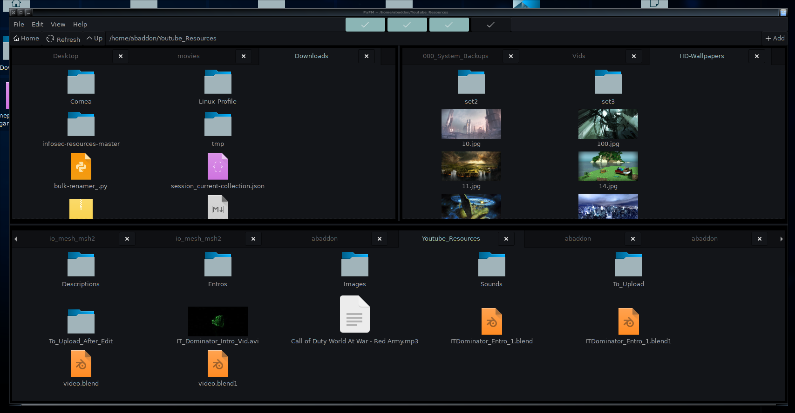
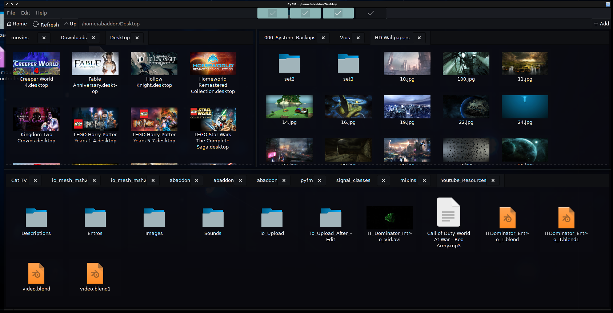
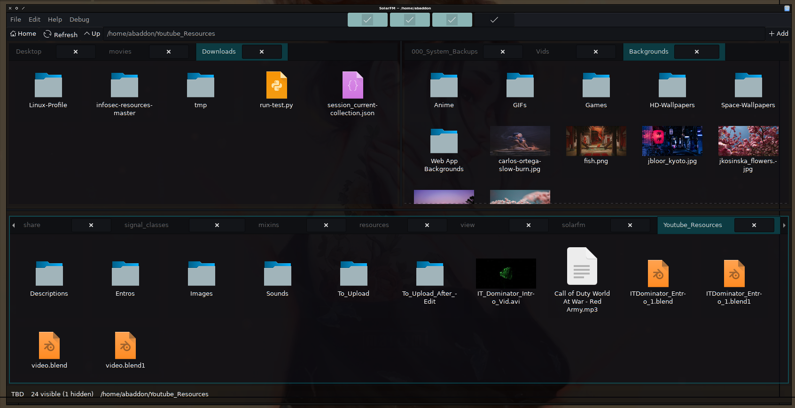
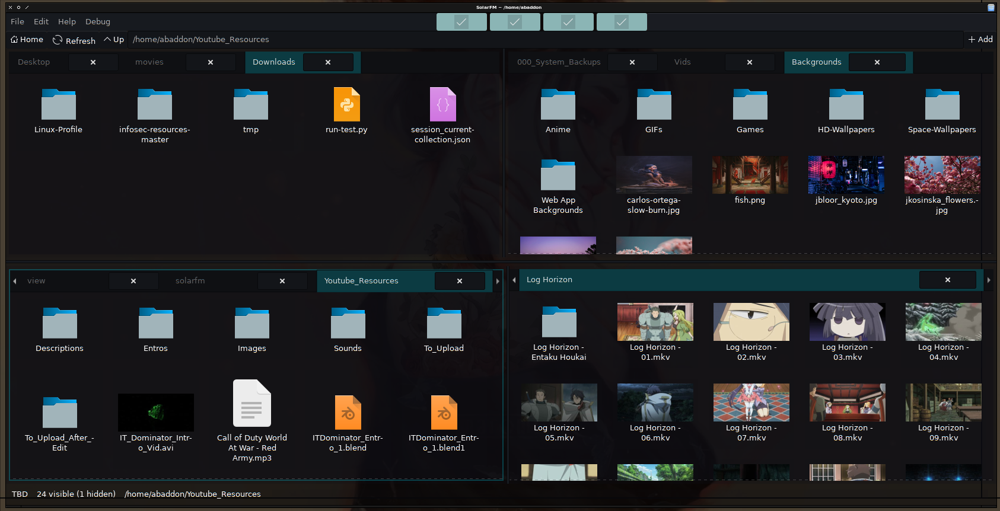

# SolarFM

# SolarFM
SolarFM is a Gtk+ Python file manager.

# Notes
```sudo apt-get install python3 wget steamcmd```

# TODO
<ul>
<li>Add prompt guards for actions.</li>
<li>Add path bar search dropdown.</li>
<li>Add "execute" and "execute in terminal" context options.</li>
<li>Add "clear trash", "restore from trash" options.</li>
<li>Add drive size free and consumed info to bottom bar.</li>
<li>Add simpleish plugin system to run bash/python scripts.</li>
<li>Add DnD context awareness for over folder drop.</li>
</ul>

# Images




