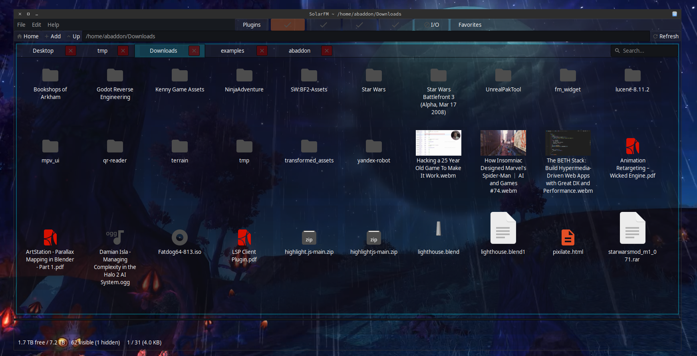
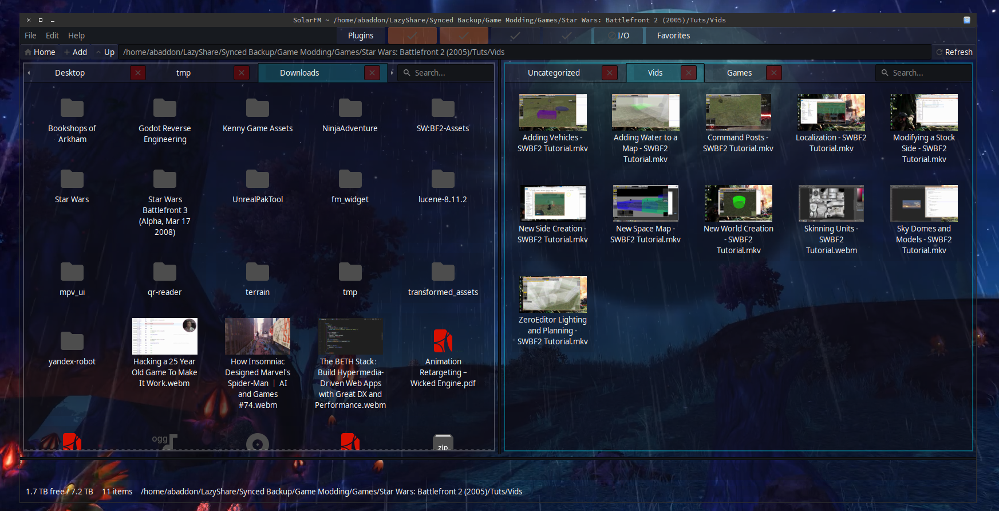
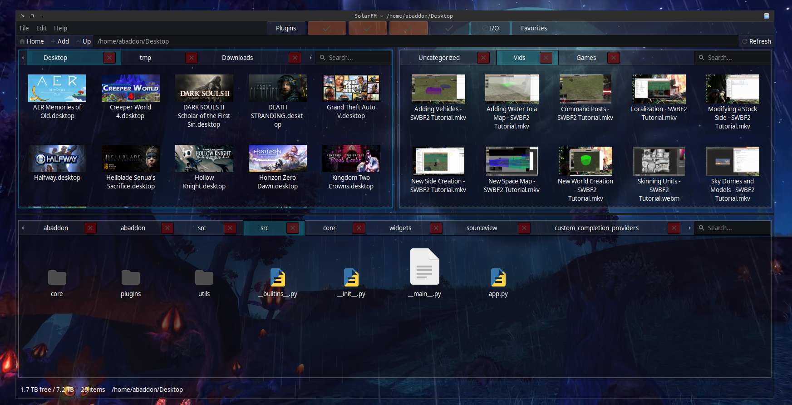
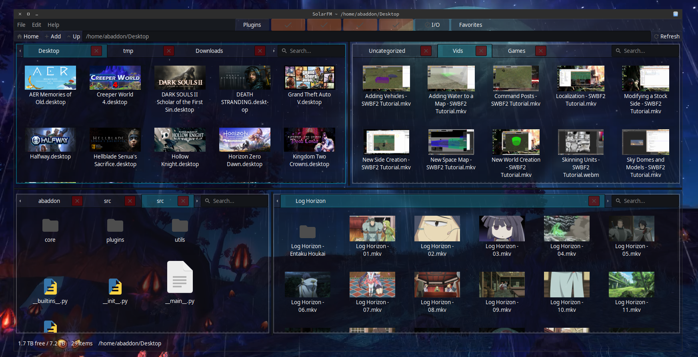

# SolarFM
SolarFM is a Gtk+ Python file manager.

# Notes
<b>Still Work in  progress! Use at own risk!</b>

Additionally, if not building a .deb then just move the contents of user_config to their respective folders.
Copy the share/solarfm folder to your user .config/ directory too.

<h6>Install Setup</h6>
```
sudo apt-get install python3.8 wget python3-setproctitle python3-gi ffmpegthumbnailer steamcmd
```

# Known Issues
Doing Ctrl+D when in Terminator (maybe other terminals too) somehow propagates the signal to SolarFM too.
A selected file in the active quad-pane will move to trash since it is the defaul keybinding for that action.

# TODO
<ul>
<li>Add simpleish preview plugin for various file types.</li>
<li>Add simpleish bulk-renamer.</li>
</ul>

# Images




