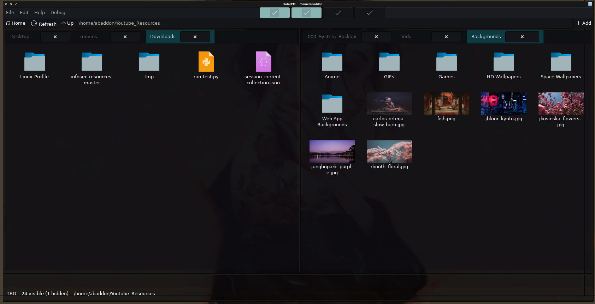

# SolarFM

# SolarFM
SolarFM is a Gtk+ Python file manager.

# Notes
<b>Still Work in  progress! Use at own risk!</b>

<h6>Install Setup</h6>
```
sudo apt-get install python3.8 wget python3-setproctitle python3-gi ffmpegthumbnailer steamcmd
```

# TODO
<ul>
<li>Add simpleish plugin system to run bash/python scripts.</li>
</ul>

# Images




